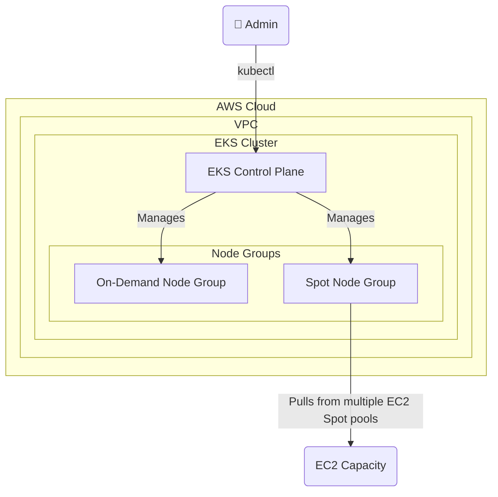

# 🚀 EKS com Node Group de Instâncias Spot


Este repositório contém um guia e exemplos de como criar um [Node Group Gerenciado](https://docs.aws.amazon.com/eks/latest/userguide/managed-node-groups.html) no Amazon EKS (Elastic Kubernetes Service) utilizando **Instâncias Spot**. O uso de Instâncias Spot pode reduzir significativamente os custos de computação do seu cluster em comparação com as instâncias On-Demand.

## 💸 O que são Instâncias Spot?

As [Instâncias Spot da Amazon EC2](https://aws.amazon.com/ec2/spot/) permitem que você aproveite a capacidade não utilizada da EC2 na nuvem AWS com um desconto de até 90% em comparação com os preços On-Demand. A principal desvantagem é que a AWS pode reivindicar essa capacidade de volta com um aviso prévio de dois minutos.

Por isso, as Instâncias Spot são ideais para cargas de trabalho tolerantes a falhas, como processamento em lote, aplicações de big data, ambientes de desenvolvimento/teste e outras tarefas que podem ser interrompidas e reiniciadas.

### Arquitetura de Exemplo



## ✅ Pré-requisitos

Antes de começar, certifique-se de que você possui:

1.  **Conta na AWS**: Uma conta ativa na AWS com as permissões necessárias para criar recursos do EKS e EC2.
2.  **AWS CLI**: A [Interface de Linha de Comando da AWS](https://aws.amazon.com/cli/) (`aws`) instalada e configurada.
3.  **kubectl**: A ferramenta de linha de comando do Kubernetes (`kubectl`) para interagir com o cluster.
4.  **eksctl**: A ferramenta de linha de comando oficial para EKS (`eksctl`) que simplifica a criação e o gerenciamento de clusters.
5.  **Um Cluster EKS Existente**: Você precisa de um cluster EKS já em execução para adicionar o novo Node Group.

## 🏗️ Criando um Node Group com Instâncias Spot

A maneira mais recomendada de gerenciar Node Groups é através de um arquivo de configuração declarativo. Isso garante que sua infraestrutura seja versionável e reprodutível.

### 1. Crie o Arquivo de Configuração

Crie um arquivo chamado `spot-nodegroup.yaml` com o seguinte conteúdo. Substitua os valores `<NOME_DO_SEU_CLUSTER>` e `<SUA_REGIAO>` pelos dados do seu ambiente.

```yaml
apiVersion: eksctl.io/v1alpha5
kind: ClusterConfig

metadata:
  name: <NOME_DO_SEU_CLUSTER> # Ex: my-eks-cluster
  region: <SUA_REGIAO>      # Ex: us-east-1

managedNodeGroups:
  - name: spot-workers
    # Define o tipo de capacidade como SPOT
    capacityType: SPOT
    # 💡 MELHOR PRÁTICA: Especifique múltiplos tipos de instância para aumentar a chance de obter capacidade Spot.
    # Escolha tipos de instância com especificações similares (vCPU/Memória).
    instanceTypes: ["m5.large", "m5a.large", "m4.large", "t3.large"] # Diversificar aumenta a resiliência
    minSize: 1
    maxSize: 10
    desiredCapacity: 2
    # Adiciona labels aos nós para que você possa direcionar pods para eles.
    labels: { role: "workers", "lifecycle": "spot" }
    tags:
      nodegroup-type: "spot-instances"
    # Permite que o Cluster Autoscaler gerencie este Node Group.
    iam:
      withAddonPolicies:
        autoScaler: true
```

**Principais Parâmetros:**
*   `capacityType: SPOT`: Este é o parâmetro chave que instrui o EKS a usar Instâncias Spot.
*   `instanceTypes`: Fornecer uma lista diversificada de tipos de instância é uma **melhor prática fundamental** para Spot. Isso permite que o EKS busque capacidade em múltiplos "pools" de Spot, aumentando a resiliência e a disponibilidade.
*   `iam.withAddonPolicies.autoScaler: true`: Adiciona as políticas de IAM necessárias para que o Cluster Autoscaler possa escalar este Node Group.

### 2. Aplique a Configuração

Execute o comando `eksctl` para criar o Node Group com base no arquivo de configuração que você criou.

```bash
eksctl create nodegroup -f spot-nodegroup.yaml
```

O `eksctl` usará o CloudFormation para provisionar todos os recursos necessários. Este processo pode levar alguns minutos.

### 3. Verifique o Node Group

Após a conclusão do comando, você pode verificar se os novos nós Spot foram adicionados ao cluster.

```bash
# Atualize seu kubeconfig para apontar para o cluster
aws eks update-kubeconfig --name <NOME_DO_SEU_CLUSTER> --region <SUA_REGIAO>

# Liste os nós e verifique os labels
kubectl get nodes --label-columns=lifecycle,eks.amazonaws.com/capacityType
```

A saída deve mostrar os novos nós com os labels `lifecycle=spot` e `eks.amazonaws.com/capacityType=SPOT`.

```
NAME                                           STATUS   ROLES    AGE   VERSION               LIFECYCLE   CAPACITYTYPE
ip-192-168-52-13.us-east-1.compute.internal    Ready    <none>   98s   v1.28.3-eks-8551a4e   spot        SPOT
ip-192-168-83-101.us-east-1.compute.internal   Ready    <none>   96s   v1.28.3-eks-8551a4e   spot        SPOT
...
```

## Removendo o Node Group

Se você precisar remover o Node Group criado, pode usar o seguinte comando:

```bash
eksctl delete nodegroup --cluster=<NOME_DO_SEU_CLUSTER> --name=spot-workers --region=<SUA_REGIAO>
```

Isso removerá de forma segura o Node Group e os recursos associados.
